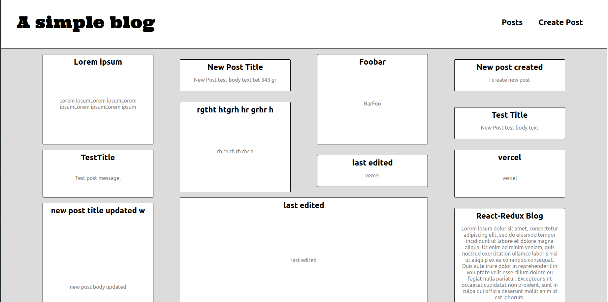

# A primitive blogging platform



Installation:

```
git clone git@github.com:Ulisseus/simple_blog.git
yarn
yarn dev
```

- `/` route displays all posts
- `/posts/:postId` route displays a single post
- `/posts/new` create post page
