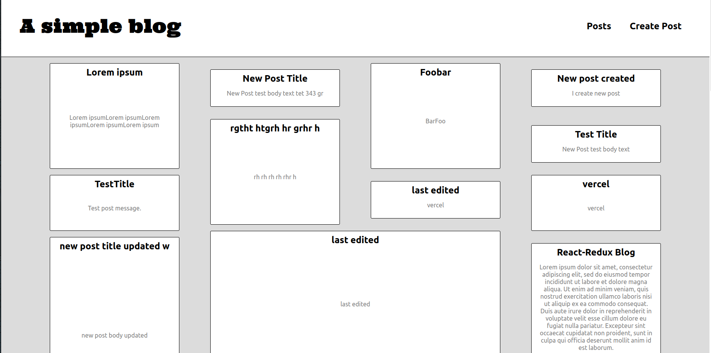

# Primitive blogging platform

A very basic blog hacked together in one day.

- [**Preview**](simple-blog-theta.vercel.app)



Installation:

```
git clone git@github.com:Ulisseus/simple_blog.git
yarn
yarn dev
```

- `/` route displays all posts
- `/posts/:postId` route displays a single post
- `/posts/new` create post page
